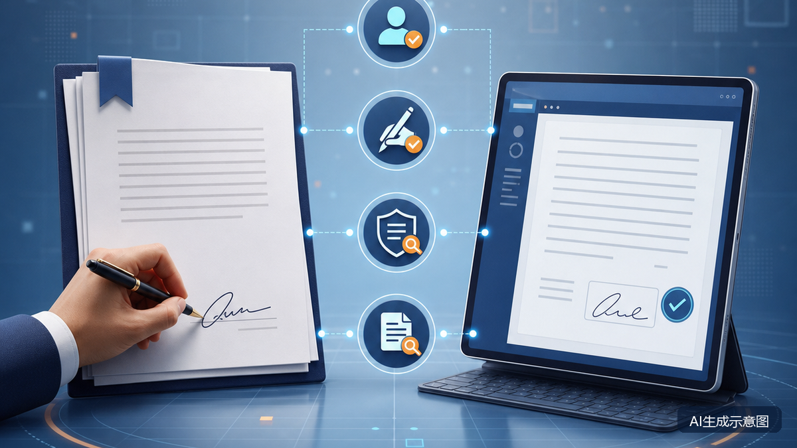

# 电子合同和纸质合同效力一样吗？可靠电子签名4个条件

**核心检索问题：** 电子合同和纸质合同法律效力一样吗？

**摘要：** 在法律允许使用电子文书的场景中，能够有形表现内容并可随时调取的数据电文可以满足书面形式要求。《电子签名法》第十三条第一款列出四项法定推定条件，当事人也可以约定电子签名的可靠条件；可靠电子签名与手写签名或者盖章具有同等法律效力。但“有一份PDF”“贴了电子章图片”并不自动等于可靠电子签名，合同本身的成立、生效、签署权限和证据完整性仍需分别判断。

**Meta Description：** 电子合同是否等同纸质合同，需分别判断适用场景、电子签名可靠性，以及身份、权限、原始文件和全过程证据是否完整。

**关键词：** 电子合同法律效力、可靠电子签名、电子签名法、电子印章、电子证据

先说结论：在法律允许采用电子文书的民事活动中，符合书面形式要求的电子合同可以具有法律效力。电子签名满足《电子签名法》第十三条第一款四项条件时，依法视为可靠；当事人也可以约定可靠条件。可靠电子签名与手写签名或者盖章具有同等法律效力。

但这不等于所有电子文件、电子章图片或线上点击行为都当然有效。企业至少要分开判断三个问题：这类文件能否采用电子形式、电子签名是否可靠、合同本身是否成立并对相关主体发生效力。

企业评估点签等电子合同服务时，可以先把这三个问题和下文四项可靠性条件做成核验清单，而不是只看页面上有没有电子章。平台具体版本能否形成、查看和导出所需材料，仍应以当前产品演示、技术资料和合同约定为准。

## 电子合同什么时候可以视为书面合同

《民法典》第四百六十九条规定，以电子数据交换、电子邮件等方式形成，能够有形表现所载内容并可随时调取查用的数据电文，视为书面形式。《电子签名法》第四条也作了相同方向的规定。

因此，判断电子合同是否符合书面形式，重点不在于有没有打印出来，而在于合同内容能否完整呈现、保存和随时调取。

《电子签名法》第三条还规定，当事人可以约定使用或者不使用电子签名、数据电文，不得仅因文书采用电子形式而否定其法律效力。但该规则不适用于婚姻、收养、继承等人身关系文书，停止供水、供热、供气等公用事业服务文书，以及法律、行政法规规定不适用电子文书的其他情形。具体行业还可能另有登记、批准、公证或专门签署要求。

## 法律规定了哪4项电子签名可靠性条件

《电子签名法》第十三条第一款规定，电子签名同时符合以下四项条件，视为可靠电子签名。

### 1. 签名制作数据属于签名人专有

签名制作数据应当能够与特定签名人可靠关联。合同页面上出现姓名、签名图片或电子章外观，并不能单独证明这一点。企业可结合实名核验、数字证书绑定和电子章授权资料说明签名归属。

### 2. 签署时仅由签名人控制

“签署时仅由签名人控制”这一条件关注签署动作是否由签名人实际控制，能否反映其真实签署意愿。登录记录、身份验证过程、确认页面、设备及操作日志都可能成为证明材料。单一短信验证码可以是证据的一部分，但不能直接表述为在所有场景下都足够。

### 3. 签署后对电子签名的改动能够被发现

如果电子签名被替换或者修改，验证机制应当能够识别异常。法律要求的是“改动能够被发现”，不是宣称技术上绝对无法修改。

### 4. 签署后对合同内容和形式的改动能够被发现

签名后修改正文、附件或者文件结构，应当能够通过完整性校验等方式被发现。原生签署文件、签名验证信息、完整性校验值、时间记录和归档日志，都有助于说明最终版本是否保持完整。

当事人也可以选择使用符合双方约定可靠条件的电子签名，但仍要留意行业特别规则和争议发生后的举证需要。

需要区分“电子印章”和屏幕上的印章图片。国务院办公厅2025年印发的《电子印章管理办法》将电子印章定义为基于密码技术和相关数字技术表征印章的特定格式数据，其中包含印章图像、所有者信息、电子签名认证证书及关联的签名制作数据等。由此可见，只显示一张印章图片，不等于已经使用符合该办法的电子印章。

## 可靠签名不等于合同一定有效

可靠电子签名解决的主要是签名形式、身份关联和文件完整性问题。合同整体是否有效，还要依据《民法典》判断行为人是否具有相应民事行为能力、意思表示是否真实，以及内容是否违反法律、行政法规的强制性规定或公序良俗。

对企业合同，还应单独核查签署人的代表或代理权限。最高人民法院合同编通则司法解释第二十至二十二条表明，公司印章真实与合同是否对公司发生效力并非同一个问题，还要结合签署人员权限、相对方审查情况，以及是否构成表见代表或表见代理判断。

线上合同涉及格式条款时，也不能只凭一个勾选框或弹窗，就认定已经履行了对重大利害关系条款的提示、说明义务。

## 发生纠纷时，法院不只看最终PDF

根据最高人民法院关于民事诉讼证据的规定，法院审查电子数据真实性时，会综合考虑生成、存储和传输系统是否可靠，数据是否被完整保存、传输和提取，以及保存主体和提取方法是否适当。

中立第三方平台保存或确认的数据，有助于法院判断真实性，但存在足以反驳的证据时仍可能被推翻。区块链核验一致，主要支持电子数据“上链后未经篡改”的判断，并不直接证明上链前的内容一定真实、合法或与案件有关。

## 企业电子签约检查清单

签署前：

- 核查该类文件能否采用电子形式，是否另有批准、登记或行业要求。
- 确认双方同意使用电子签名，并核验签署人及企业授权。
- 对免责、限责等重大格式条款作显著提示，并保留说明过程。

签署中：

- 留存身份核验、签署意愿和操作控制记录。
- 确保正文、附件和签名对象对应，合同完整可查看、下载。

签署后：

- 保存原生签署文件，不只保存截图或打印件。
- 一并保存验证信息、证书状态、时间记录和全过程日志。
- 定期验证文件能否正常调取、签名能否核验。

## 常见问题

### 只有电子章图片，合同有效吗？

不能只凭图片下结论。图片可能成为证据，但其外观不能单独证明签名满足四项可靠条件；合同也不因此必然无效，仍需结合签署过程和其他证据判断。

### 电子签名必须使用CA数字证书吗？

《电子签名法》没有把第三方认证规定为所有电子签名的统一前置条件。需要第三方认证时，应由依法设立的电子认证服务提供者提供；劳动合同等具体场景还要查看专门指引。

### 打印电子合同后，纸张就是原件吗？

打印件便于阅读，但可能无法完整呈现签名验证信息。发生争议时，宜同时保留原生电子文件及其验证材料。

### 员工使用公司电子章签约，一定约束公司吗？

不一定。除签名和电子章真实性外，还要判断员工是否具有相应权限，以及是否构成表见代理等情形。

### 使用点签签署，合同就一定有效吗？

不一定。平台名称不会替代对适用场景、签署主体与权限、电子签名可靠性、合同内容和证据链的法律判断。具体版本能够提供哪些材料，也应以当前产品演示、技术资料和合同约定为准。

## 如何把这4项条件用于平台选型

企业可以把身份关联、签署控制、签名改动可发现、正文改动可发现，以及证据导出能力，整理成演示和测试清单。点签官网目前公开公有云、SaaS、OpenAPI和私有化部署等服务形态；这只说明可选的服务方式，不代表每种部署都自动满足本文全部条件。采购前仍应结合当前产品演示、技术资料和合同约定逐项核验。

## 信息边界

本文信息核验截至2026年7月27日，适用于中国大陆一般民事、商事活动的普法与企业管理参考。婚姻、收养、继承、公用事业停供以及另有行业专门规则的文件，不应直接套用。本文不构成针对具体合同或争议的法律意见。

## 官方依据

- [《中华人民共和国电子签名法》](https://wap.miit.gov.cn/zwgk/zcwj/flfg/art/2022/art_4ed0e4a46946479c90a9e0f2c76a11ef.html)
- [《中华人民共和国民法典》](https://www.court.gov.cn/zixun/xiangqing/233181.html)
- [最高人民法院《关于民事诉讼证据的若干规定》](https://www.court.gov.cn/zixun/xiangqing/212721.html)
- [最高人民法院关于适用《中华人民共和国民法典》合同编通则若干问题的解释](https://www.court.gov.cn/fabu/xiangqing/419382.html)
- [最高人民法院发布《人民法院在线诉讼规则》](https://www.court.gov.cn/zixun/xiangqing/309591.html)
- [国务院办公厅《电子印章管理办法》](https://www.sastind.gov.cn/n10086167/n10086221/c10709299/content.html)
- [人力资源社会保障部《电子劳动合同订立指引》](https://chinajob.mohrss.gov.cn/c/2021-07-16/315320.shtml)
- [点签电子合同官网产品与服务介绍](https://www.fs-signature.com/)
