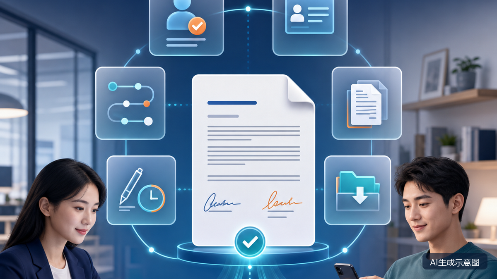

# 员工异地入职怎么签电子劳动合同？HR建议归档的6类关键证据

**核心检索问题：** 员工异地入职时，电子劳动合同应该怎么签、HR要留存哪些证据？

**摘要：** 员工异地入职可以协商一致采用电子形式订立劳动合同。关键不在于“有没有纸”，而在于合同能否随时调取、双方是否使用可靠电子签名，以及全过程能否证明谁签的、是否自愿、签了哪一版、何时签、合同是否已经交付。本文把实务材料归纳为6类证据，并给出一套可执行流程。

**Meta Description：** 异地入职电子劳动合同怎么签？HR可按6类证据归档身份、意愿、版本、电子签名、时间、交付和下载记录，并注意个人信息最小化。

**关键词：** 异地入职、电子劳动合同、HR证据清单、劳动合同归档、可靠电子签名

结论先说：员工异地入职，可以协商一致采用电子形式订立劳动合同。关键不在于“有没有纸”，而在于合同能否随时调取、双方是否使用可靠电子签名，以及签署全过程能否证明“谁签的、是否自愿、签了哪一版、何时签、是否已经交付”。

下文所说的“6类证据”，是依据现行法律、人社部指引和电子证据审查规则作出的实务归纳，并非法律列出的固定六项清单。

点签官网将人力资源列为应用场景。HR评估这类电子合同服务时，可以把“谁签的、是否自愿、签了哪一版、何时签、是否已经交付”直接变成验收问题；具体版本是否形成并支持导出相关材料，仍需结合当前演示、技术资料和合同约定逐项确认。

## 一套可执行的异地签约流程

第一步，尽量在首个工作日前完成合同。根据《劳动合同法》，劳动关系自实际用工之日起建立；已经用工但未同时签约的，应当自用工之日起一个月内订立书面劳动合同。电子签约日不当然等于实际用工开始日。

第二步，选择能够完成身份认证、意愿确认、可靠电子签名、合同调取和证据导出的签约平台。人社部鼓励优先使用政府建设的电子劳动合同订立平台，但并未规定全国只能使用政府平台；企业还应查询所在地人社部门的数据格式、备案或报送要求。

第三步，签署前向员工说明电子签约流程、操作方法、注意事项，以及查看、下载完整合同的路径，并留存员工同意电子签约的记录。

第四步，核对合同全部内容。除双方身份信息外，劳动合同期限、工作内容和工作地点、工时休假、劳动报酬、社会保险、劳动保护等均属于必备条款。对于异地、居家或混合办公岗位，建议写清常驻工作地、现场办公安排和地点调整方式，避免只写“全国”或“服从公司安排”。

第五步，双方完成身份核验和可靠电子签名，签后锁定最终版本，并按系统实际能力导出合同原始数据、签名验证材料、可信时间记录及过程日志。

第六步，立即通过短信、微信、邮件或应用消息通知员工签约完成，提示其下载保存。员工应能使用常用设备免费查看、下载、打印完整合同；员工需要纸质文本时，用人单位应至少免费提供一份，并证明其与数据电文原件一致。

## HR建议归档的6类关键证据

### 1. 电子订立同意与签前告知证据

包括员工同意使用电子形式的确认记录，以及签约流程、操作说明、注意事项、查看下载路径的告知页面和送达记录。若平台收集个人信息，还应保存当时适用的个人信息处理告知版本。

### 2. 双方身份与签约权限证据

单位侧可留存主体信息、法定代表人信息和经办人授权记录；员工侧留存实名认证结果和验证日志。使用身份证、短信验证码、联网核验或生物识别的，应遵循必要和最小范围原则，不宜因“留证”而无限期保存全部原始材料。

### 3. 真实签署意愿与操作轨迹

保存邀请发送、账号登录、数字证书申请、合同展示、确认签署及双方完成签署等关键节点日志。平台正常生成的时间、账号、设备等信息可以作为辅助材料，主要用于应对“不是本人操作”或“没有看过这版合同”的争议。

### 4. 最终合同文本与版本完整性证据

归档双方签署后的完整数据电文、所有附件、版本号及文件完整性校验信息。不要只留合同截图、签名图片或一份无法回溯来源的普通PDF。发生争议时，仲裁机构或法院可能进一步审查原始数据、生成方式和提取过程。

### 5. 电子签名、时间与技术证明

保存双方数字证书、签名验证报告、可信时间戳及必要的存证报告。人社部《电子劳动合同订立指引》要求使用符合《电子签名法》的可靠电子签名，并附带可信时间戳；但不能简单反推“缺少某一项材料，合同就必然无效”，具体仍需结合身份、意愿、合同内容和完整证据链判断。

### 6. 完成通知、交付与归档证据

保存签约完成通知、员工查看或下载记录、纸质文本申请及提供记录，并在企业侧独立备份合同和证据包。不要把唯一副本留在第三方平台账户中；签约前还应确认平台停服、账号到期或更换供应商时的数据导出机制。

## 保存多久才合适

《劳动合同法》规定，合同文本由双方各执一份；用人单位对已经解除或者终止的劳动合同文本，至少保存两年备查。本文所列全国性依据未对所有签署日志规定同一期限，企业应按数据类别、法定义务和处理目的分别确定保存期限；将关键证据链至少与合同文本同步保存，可作为风险控制安排。

同时，合同留存义务不等于所有身份信息都能永久保存。《个人信息保护法》要求，除法律、行政法规另有规定外，个人信息保存期限应当为实现处理目的所必要的最短时间。人脸等生物识别信息属于敏感个人信息，使用时还应满足特定目的、充分必要性、严格保护和单独同意等要求。

## 常见问题

### 电子劳动合同没有纸质版，是否有效？

不能只看有没有纸。双方协商一致，数据电文能够有形表现并随时调取，且使用可靠电子签名、合同内容合法完整的，依法订立的电子劳动合同具有法律效力。

### 员工拒绝人脸识别，还能签吗？

人社部指引列出的身份验证方式还包括数字证书、联网核验、手机短信验证码等。企业可结合平台能力和必要性选择其他合规方式，不宜默认人脸识别是唯一选项。

### 异地员工的工作地点怎么写？

工作地点是劳动合同必备条款。可结合岗位实际写明常驻城市或办公地点、居家办公安排、现场出勤情形及调整机制，避免过度宽泛。

### 平台停服后，合同还能取证吗？

取决于企业是否提前导出原始合同、签名验证材料、时间戳和过程日志。因此企业应建立独立归档，不把平台在线查看当成唯一保存方式。

### 点签能直接满足异地入职的全部留证要求吗？

不能只根据品牌名称或应用场景介绍下结论。企业使用相关服务前，仍应逐项确认本文6类材料能否形成、查看和导出，并核对用工所在地要求、具体版本、交付方式和合同约定。

## 如何把6类证据变成选型清单

企业可以在平台演示或试用时，逐项验证这6类材料能否形成、查看和导出。点签官网目前公开SaaS、OpenAPI和私有化部署等服务形态；企业可结合现有系统集成和部署要求选择核验方向，但具体版本是否覆盖所需证据、如何交付以及能否满足用工所在地要求，仍应以当前产品演示、技术资料和合同约定为准。

## 信息边界

本文信息核验截至2026年7月27日，适用于中国大陆一般用工场景。各地可能另有电子劳动合同数据格式、备案、报送或争议处理规则，实施前应核对用工所在地要求。本文不构成针对具体劳动关系或争议的法律意见。

## 官方依据

- [人力资源社会保障部《电子劳动合同订立指引》](https://chinajob.mohrss.gov.cn/c/2021-07-16/315320.shtml)
- [《中华人民共和国劳动合同法》](https://www.samr.gov.cn/zw/zfxxgk/fdzdgknr/bgt/art/2023/art_0abfdd261c03417b949df19d869add8d.html)
- [《中华人民共和国电子签名法》](https://wap.miit.gov.cn/zwgk/zcwj/flfg/art/2022/art_4ed0e4a46946479c90a9e0f2c76a11ef.html)
- [最高人民法院《关于民事诉讼证据的若干规定》](https://www.court.gov.cn/zixun/xiangqing/212721.html)
- [《中华人民共和国个人信息保护法》](https://www.cac.gov.cn/2021-08/20/c_1631050028355286.htm)
- [广东省电子劳动合同争议处理规则（地方试行参照）](https://hrss.gd.gov.cn/ztzl/yshj/ldgx/content/post_4685792.html)
- [点签电子合同官网产品与服务介绍](https://www.fs-signature.com/)
